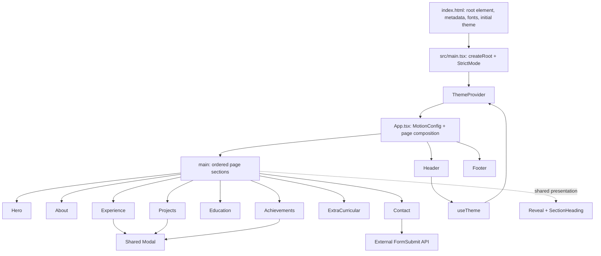
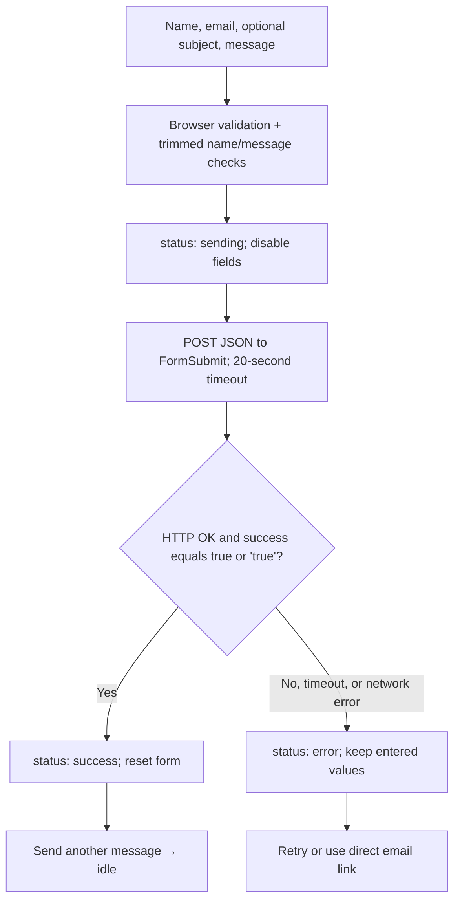

# Sami — Software Engineering Portfolio

A personal portfolio for **Md Shamsur Rahman Sami**, showcasing software engineering experience, web and mobile applications, education, and achievements.

[Portfolio](https://mdshamsurrahmansami.netlify.app/) · [GitHub](https://github.com/Sami-115667) · [LinkedIn](https://www.linkedin.com/in/md-shamsur-rahman-sami-0a677b246/)

This README documents the current implementation, its architecture, and where to make changes. **কোন ফাইল কী কাজ করে এবং কোথায় পরিবর্তন করলে কী বদলাবে—নিচের file guide ও editing guide-এ দেওয়া আছে।**

## Contents

- [Overview](#overview)
- [Technology stack](#technology-stack)
- [Local setup and commands](#local-setup-and-commands)
- [Architecture](#architecture)
- [Folder structure](#folder-structure)
- [File guide — কোন ফাইলের কী কাজ](#file-guide)
- [State and data flow](#state-and-data-flow)
- [Editing guide](#editing-guide)
- [Build and deployment](#build-and-deployment)
- [Validation and troubleshooting](#validation-and-troubleshooting)

## Overview

The portfolio is a **single-page React application** with section-based navigation. It includes:

- A photo introduction, résumé download, and social links.
- An about section with capabilities and **30+ projects built**.
- Work experience displayed **before projects**, with expandable entries and photo viewers.
- Seven selected projects with category filters and detail dialogs.
- **ZARIBAN** and **Infinity Edu-care** featured first, with live links and September–October 2026 dates.
- Education, achievements, and community activities.
- A contact form, email copy action, and direct contact links.
- Persistent dark/light themes, responsive layouts, and reduced-motion support.

The project has **no application backend, database, CMS, or authentication system**. Portfolio content is maintained in the source files. FormSubmit handles contact submissions externally. The featured e-commerce and coaching-center applications are separate websites linked from this portfolio; their implementations are not part of this repository.

## Technology stack

| Technology | Responsibility |
| --- | --- |
| React 18 + React DOM | Render components and manage interactive state in the browser. |
| TypeScript 5 | Define component props, project records, and state types. |
| Vite 5 + React plugin | Development server, React Fast Refresh, and production bundling. |
| Custom CSS + Tailwind CSS 3 | Page design, responsive layouts, CSS theme variables, and available utility classes. Most current visual styling lives in `src/index.css`. |
| PostCSS + Autoprefixer | Process Tailwind directives and CSS during development/build. |
| Framer Motion 11 | Animate section reveals and respect reduced-motion preferences. |
| Lucide React | Render icons as React components. |
| React Context + localStorage | Share and remember the selected theme. |
| Browser APIs | IntersectionObserver for active navigation, native dialogs, clipboard access, and fetch/AbortController for contact requests. |
| FormSubmit | External contact submission service. |
| Google Fonts | Load DM Sans, Manrope, and IBM Plex Mono from `index.html`. |
| ESLint + TypeScript ESLint | Check TypeScript/React code, hooks, and refresh-related conventions. |

Versions above describe the dependency families in [package.json](package.json). [package-lock.json](package-lock.json) records the resolved dependency tree.

`react-intersection-observer` and `react-type-animation` remain listed as dependencies but are not imported by the current source. Active navigation uses the browser's IntersectionObserver, and reveal animations use Framer Motion.

## Local setup and commands

You need Node.js and npm installed. This repository does not currently pin a Node version with an `engines` field or runtime version file.

From an existing checkout:

```bash
npm ci
npm run dev
```

Or clone the repository first:

```bash
git clone https://github.com/Sami-115667/My-Portfolio.git
cd My-Portfolio
npm ci
npm run dev
```

Open the address printed by Vite, normally **http://localhost:5173**. If that port is occupied, Vite may select another port.

| Command | What it does |
| --- | --- |
| `npm ci` | Install the dependency versions recorded in the lockfile. |
| `npm run dev` | Start the Vite development server. |
| `npm run build` | Bundle the production website into `dist/`. |
| `npm run preview` | Serve the existing production build locally, normally on port 4173. Run the build first. |
| `npm run lint` | Run ESLint over the project. |
| `npx tsc --noEmit -p tsconfig.app.json` | Type-check application source without generating files. |
| `npx tsc --noEmit -p tsconfig.node.json` | Type-check the Vite configuration. |

**Build and type checking are separate:** the build script runs `vite build`; it does not run `tsc`.

No environment variables or API keys are required by the current source. The contact recipient is configured directly in `Contact.tsx`.

On Windows PowerShell, if execution policy blocks `npm.ps1`, use `npm.cmd` and `npx.cmd` for the same commands.

## Architecture

### Application entry and component tree



1. `index.html` provides `#root`, metadata, fonts, and a small script that applies the saved theme before React starts.
2. `src/main.tsx` imports the global CSS and mounts the app inside React StrictMode and ThemeProvider.
3. `App.tsx` sets the section order and wraps the page in Framer Motion's reduced-motion configuration.
4. Each section owns its content and local interactions. Shared components provide consistent headings, reveals, and dialogs.
5. Vite builds the source into static HTML, CSS, JavaScript, and public assets.

### Page order and navigation

| Order | Component | Anchor |
| --- | --- | --- |
| 1 | Hero | `#home` |
| 2 | About | `#about` |
| 3 | Experience | `#experience` |
| 4 | Projects | `#projects` |
| 5 | Education | `#education` |
| 6 | Achievements | `#achievements` |
| 7 | ExtraCurricular | `#extracurricular` |
| 8 | Contact | `#contact` |

Header and Footer sit outside `main`. The header's primary navigation contains About, Experience, Work, and Contact. Navigation uses URL fragments and CSS scrolling; there is no client-side router.

### Styling architecture

[src/index.css](src/index.css) is the main design source:

- `:root` defines light-theme variables; `:root.dark` overrides them for dark mode.
- Variables such as `--bg`, `--surface`, `--text`, `--muted`, `--faint`, `--border`, and `--accent` control the palette.
- Shared classes include `.container`, `.section`, `.button`, `.tags`, and `.text-link`.
- Section-specific rules style the hero, capabilities, project artwork, experience, education, and contact form.
- Media queries adapt layouts around 1100, 900, 760, 450, and 390px, with an additional wide-screen adjustment at 1500px.
- Later media queries can override earlier ones, including additional mobile typography/layout adjustments.
- `prefers-reduced-motion` rules reduce CSS animation and disable smooth scrolling.

[tailwind.config.js](tailwind.config.js) still defines utility palettes, font aliases, and animation helpers. Its older Inter/Fira Code font aliases are not the current page's font source: the visible font setup is in `index.html` and `src/index.css`.

## Folder structure

```text
.
├── index.html
├── package.json
├── package-lock.json
├── vite.config.ts
├── tailwind.config.js
├── postcss.config.js
├── eslint.config.js
├── tsconfig.json
├── tsconfig.app.json
├── tsconfig.node.json
├── .gitignore
├── README.md
├── public/
│   ├── favicon.svg
│   ├── mypic.jpg
│   ├── mypic1.jpg
│   ├── resume.pdf
│   ├── resume1.pdf
│   ├── zariban-preview.jpg
│   ├── infinity-edu-care-preview.jpg
│   ├── q1.png
│   ├── q2.png
│   ├── q3.png
│   ├── genmorphics_work.png
│   ├── idea.jpeg
│   ├── ideawork.jpeg
│   └── llmworkshop.jpeg
└── src/
    ├── main.tsx
    ├── App.tsx
    ├── index.css
    ├── vite-env.d.ts
    ├── context/
    │   ├── ThemeContext.tsx
    │   └── useTheme.ts
    └── components/
        ├── Header.tsx
        ├── Footer.tsx
        ├── Modal.tsx
        ├── Reveal.tsx
        ├── SectionHeading.tsx
        └── sections/
            ├── Hero.tsx
            ├── About.tsx
            ├── Experience.tsx
            ├── Projects.tsx
            ├── Education.tsx
            ├── Achievements.tsx
            ├── ExtraCurricular.tsx
            └── Contact.tsx
```

`node_modules/` is generated by dependency installation. `dist/` is generated by the production build. Both are ignored by Git; edit the source rather than generated output.

<a id="file-guide"></a>

## File guide — কোন ফাইলের কী কাজ

### Entry points, theme, and shared components

| File | Responsibility / ফাইলটির কাজ |
| --- | --- |
| [index.html](index.html) | Browser-এর initial HTML। Root element, title, description/Open Graph metadata, favicon, Google Fonts এবং React চালুর আগের theme script থাকে। |
| [src/main.tsx](src/main.tsx) | React application চালু করে; CSS import করে; StrictMode ও ThemeProvider দিয়ে App wrap করে। |
| [src/App.tsx](src/App.tsx) | পুরো page-এর composition ও section order ঠিক করে। Header, Footer, skip link এবং reduced-motion configuration থাকে। |
| [src/index.css](src/index.css) | Layout, font size, spacing, light/dark colors, responsive breakpoints, project visuals, modal ও hover styles নিয়ন্ত্রণ করে। |
| [src/vite-env.d.ts](src/vite-env.d.ts) | TypeScript-কে Vite client-এর type definitions দেয়। Runtime UI তৈরি করে না। |
| [src/context/ThemeContext.tsx](src/context/ThemeContext.tsx) | ThemeProvider component। Theme state রাখে; HTML class, browser color scheme, theme-color metadata ও localStorage update করে। |
| [src/context/useTheme.ts](src/context/useTheme.ts) | Theme type, shared context এবং `useTheme()` hook export করে। Header এখান থেকে theme ও toggle function নেয়। |
| [src/components/Header.tsx](src/components/Header.tsx) | Logo, desktop/mobile navigation, theme button, contact link ও mobile résumé link। Scroll অনুযায়ী active section চিহ্নিত করে। |
| [src/components/Footer.tsx](src/components/Footer.tsx) | Branding, বর্তমান বছরের copyright ও Back to top link দেখায়। |
| [src/components/Reveal.tsx](src/components/Reveal.tsx) | Content viewport-এ এলে একবার fade/slide animation চালায়। Props: `children`, optional `className`, `delay`। Reduced-motion preference মানে। |
| [src/components/SectionHeading.tsx](src/components/SectionHeading.tsx) | একই style-এ section number, label, heading ও optional পাশের content দেখায়। Props: `number`, `label`, `title`, optional `children`। |
| [src/components/Modal.tsx](src/components/Modal.tsx) | Project details ও বড় ছবি দেখানোর shared native dialog। Focus loop, Escape/backdrop close, scroll lock ও আগের button-এ focus ফেরানো সামলায়। Props: `children`, `onClose`, `titleId`, optional `className`। |

### Page sections

| File | Responsibility / ফাইলটির কাজ |
| --- | --- |
| [Hero.tsx](src/components/sections/Hero.tsx) | Intro headline, portrait, availability, location, résumé download, social links এবং everyday toolkit দেখায়। |
| [About.tsx](src/components/sections/About.tsx) | Bio, experience/project statistics এবং full-stack, mobile, AI capability cards। `capabilities` array এখানেই থাকে। |
| [Experience.tsx](src/components/sections/Experience.tsx) | `jobs` array থেকে role, company, date, location, description ও skills দেখায়। Accordion খুলে details এবং gallery দেখা যায়; image click করলে Modal খোলে। |
| [Projects.tsx](src/components/sections/Projects.tsx) | Project type/data, category filters, featured/compact cards, artwork, screenshots, live/source links এবং details Modal—সব project-related কাজ করে। |
| [Education.tsx](src/components/sections/Education.tsx) | University degree, courses, college/school information ও GPA দেখায়। Content সরাসরি JSX-এর মধ্যে আছে। |
| [Achievements.tsx](src/components/sections/Achievements.tsx) | `achievements` array থেকে milestone ও certificate cards দেখায়; ছবি বড় করে দেখার Modal খোলে। |
| [ExtraCurricular.tsx](src/components/sections/ExtraCurricular.tsx) | `activities` array থেকে community, mentorship, exploration ও early academic achievement দেখায়। |
| [Contact.tsx](src/components/sections/Contact.tsx) | Contact details, email copy, form validation, FormSubmit request, timeout এবং sending/success/error UI সামলায়। Recipient email এখানেই নির্ধারিত। |

### Build and configuration files

| File | Responsibility / ফাইলটির কাজ |
| --- | --- |
| [package.json](package.json) | Project metadata, npm commands, runtime dependencies এবং development tools-এর তালিকা। |
| [package-lock.json](package-lock.json) | Dependency-এর resolved versions ও integrity information ধরে রাখে; `npm ci` এটি ব্যবহার করে। |
| [vite.config.ts](vite.config.ts) | Vite-এ React plugin চালু করে এবং development dependency optimization থেকে `lucide-react` বাদ রাখে। |
| [tailwind.config.js](tailwind.config.js) | কোন files scan হবে, class-based dark mode, extended colors/fonts/spacing/animations নির্ধারণ করে। |
| [postcss.config.js](postcss.config.js) | CSS processing-এর জন্য Tailwind ও Autoprefixer enable করে। |
| [eslint.config.js](eslint.config.js) | JavaScript/TypeScript, React Hooks ও React Refresh lint rules সেট করে; `dist/` ignore করে। |
| [tsconfig.json](tsconfig.json) | App ও Vite configuration-এর TypeScript project references এক জায়গায় রাখে। |
| [tsconfig.app.json](tsconfig.app.json) | `src/`-এর strict TypeScript rules, DOM types, React JSX এবং unused-code checks নির্ধারণ করে। |
| [tsconfig.node.json](tsconfig.node.json) | `vite.config.ts`-এর TypeScript compilation/checking settings নির্ধারণ করে। |
| [.gitignore](.gitignore) | Dependencies, build output, logs, local files, environment file ও editor artifacts Git থেকে বাদ রাখে। |
| [README.md](README.md) | Setup, architecture, file responsibilities ও maintenance documentation। |

### Public assets

Files in `public/` are served from the website root. For example, `public/resume.pdf` is referenced as **`/resume.pdf`**, not `/public/resume.pdf`. Vite copies public files into the build output.

| Asset | Used for |
| --- | --- |
| [favicon.svg](public/favicon.svg) | Browser tab icon, referenced by `index.html`. |
| [mypic.jpg](public/mypic.jpg) | Main portrait in Hero. |
| [resume.pdf](public/resume.pdf) | Active résumé download in Hero, Header's mobile menu, and Experience. |
| [zariban-preview.jpg](public/zariban-preview.jpg) | Saved screenshot for the ZARIBAN project card. |
| [infinity-edu-care-preview.jpg](public/infinity-edu-care-preview.jpg) | Saved screenshot for the Infinity Edu-care project card. |
| [q1.png](public/q1.png), [q2.png](public/q2.png), [q3.png](public/q3.png) | Quail internship gallery in Experience. |
| [genmorphics_work.png](public/genmorphics_work.png) | Genmorphics work certificate in Experience. |
| [idea.jpeg](public/idea.jpeg) | BD App Ideathon achievement image. |
| [llmworkshop.jpeg](public/llmworkshop.jpeg) | University workshop certificate image. |
| [mypic1.jpg](public/mypic1.jpg) | Additional portrait asset; not referenced by current components. |
| [resume1.pdf](public/resume1.pdf) | Additional résumé asset; not the current download target. |
| [ideawork.jpeg](public/ideawork.jpeg) | Additional achievement/workshop asset; not referenced by current components. |

Preview images are saved assets, not live embeds or automatically refreshed screenshots.

## State and data flow

### Theme

```text
Saved localStorage["theme"] value
    → index.html applies the initial HTML class
    → ThemeProvider initializes React state
    → Header reads useTheme() and calls toggleTheme()
    → Provider updates HTML class, colorScheme, theme-color, and storage
    → CSS variables update the appearance throughout the page
```

The default is **dark** unless the stored value is `light`. It does not automatically follow the operating system's color preference. If storage is unavailable, theme switching still works for the current session.

### Navigation, projects, and galleries

| Owner | State | Effect |
| --- | --- | --- |
| Header | `menuOpen`, `active` | Shows mobile navigation and highlights the visible section using IntersectionObserver. |
| Projects | `filter`, `selected` | Filters the local project array and opens/closes a detail dialog. |
| Experience | `openJob`, `photo` | Opens one experience entry at a time and selects a gallery image for the dialog. The first entry starts open. |
| Achievements | `selected` | Selects an achievement image to enlarge. |
| Contact | `status`, `error`, `copyState` | Displays submission progress, feedback, and email-copy results. |

Only theme selection persists. Project filters, open galleries, and form feedback reset on a page reload.

Project records are filtered first, then split into featured and compact groups. **Array order is preserved within each group; all featured cards appear before compact cards.** The filter count reflects the selected records, not the lifetime total of 30+ projects.

`ProjectArtwork` is a helper inside `Projects.tsx`. It shows a screenshot when `preview` exists, a CSS phone illustration for Swapno, and a healthcare illustration as the current fallback. The illustrative previews are labeled as interface concepts; the healthcare illustration includes sample data.

### Contact submission



The endpoint is constructed as `https://formsubmit.co/ajax/` plus the `email` constant. The JSON body contains `name`, `email`, `subject`, `message`, `_subject`, and `_captcha`.

A hidden `_honey` field is checked locally before sending; it is not included in the current JSON payload. Requests are aborted on timeout or component unmount. A successful response confirms the service accepted the submission; inbox delivery still depends on the external service and recipient setup.

Email copying uses `navigator.clipboard.writeText()`, with feedback cleared after four seconds and a manual-copy fallback message.

## Editing guide

### Where should I make a change?

| Change | Edit here |
| --- | --- |
| Intro text, profile photo, availability, toolkit | `Hero.tsx`; portrait asset in `public/`. |
| Bio, capabilities, experience years | `About.tsx`. |
| Total project count | Update both the statistic in `About.tsx` and intro copy in `Projects.tsx`. |
| Job, company, dates, internship photos | The `jobs` array in `Experience.tsx`. Keep `images` and `imageLabels` aligned. |
| Project information, categories, links, order | The `Project` type, `projects` array, and `filters` in `Projects.tsx`. |
| Education details | JSX in `Education.tsx`. |
| Certificates and achievements | The `achievements` array in `Achievements.tsx`. |
| Community/mentoring text | The `activities` array in `ExtraCurricular.tsx`. |
| Contact recipient, phone, location | `Contact.tsx`; also update Header's direct email link when changing the address. |
| Social profile URLs | `Hero.tsx` and `Contact.tsx`; update README links as needed. |
| Résumé | Replace `public/resume.pdf`. If renaming it, update Hero, Header, and Experience links. |
| Section order | Move components in `App.tsx`; update Header navigation order and section numbers when relevant. |
| Fonts, text sizes, colors, spacing | `src/index.css`; font loading is in `index.html`. Check both base styles and media queries. |
| Browser title, search/social description, favicon | `index.html` and `public/favicon.svg`. |
| Default theme | Keep the initialization logic in `index.html` and `ThemeContext.tsx` consistent. |
| Shared dialog behavior | `Modal.tsx`. |
| Reveal animation | `Reveal.tsx`; app-wide motion preference is in `App.tsx`. |

### Add a featured project

Add a record to the `projects` array in [Projects.tsx](src/components/sections/Projects.tsx). Put it before existing featured records if it should appear first.

```tsx
{
  id: "new-project",
  title: "New Project",
  category: "Web",
  type: "WEB APPLICATION",
  description: "A short explanation for the project card.",
  detail: "A fuller explanation for the project dialog.",
  technologies: ["React", "TypeScript"],
  live: "https://example.com",
  preview: "/new-project-preview.jpg",
  period: "September – October 2026",
  featured: true,
  features: [
    "A concrete feature",
    "Another feature",
  ],
}
```

1. Add the referenced screenshot to `public/new-project-preview.jpg`.
2. Use `Web`, `Mobile`, or `Systems` for the category. A new category also requires updating the `Category` type and `filters` array.
3. For a public repository, `github` is the **repository name**, such as `HealthCare`, not a full URL. Links are constructed under `https://github.com/Sami-115667/`.
4. For private code, omit `github` and provide `live`, as ZARIBAN and Infinity Edu-care do. The detail dialog prefers the live link when both exist.
5. Supply `preview` for a new featured project, or explicitly extend `ProjectArtwork`; otherwise the current fallback shows the healthcare illustration.
6. Omitting `featured` puts a record in the compact group. Review that group's icon and link rendering when adding a different project type: it currently maps icons for network/university/game projects and exposes GitHub links when supplied.

The displayed selection counts are calculated from the array. The lifetime **30+** total remains manually maintained content.

### Add a section

Create the component under `src/components/sections/`, give it a unique `id`, import it in `App.tsx`, and insert it at the intended position. Use `Reveal` and `SectionHeading` where appropriate. Add a Header navigation entry if visitors should reach it from the primary menu, then add styles in `src/index.css`.

### Change typography or themes

Edit semantic variables in `:root` and `:root.dark` for colors, and section/shared selectors for type sizes. Keep mobile overrides consistent with desktop changes. The small text inside CSS project illustrations is part of the artwork; page descriptions, form fields, buttons, and navigation have separate selectors.

## Build and deployment

Run the checks and build:

```bash
npm run lint
npx tsc --noEmit -p tsconfig.app.json
npx tsc --noEmit -p tsconfig.node.json
npm run build
npm run preview
```

The deployable artifact is **`dist/`**. It contains the generated HTML and bundled assets plus files copied from `public/`. This application needs static hosting; it does not need a running Node server in production.

For the portfolio's Netlify deployment, the build settings are:

| Setting | Value |
| --- | --- |
| Project/base directory | Repository root |
| Build command | `npm run build` |
| Publish directory | `dist` |

There is no hosting configuration file or CI workflow checked into this repository. Hosting settings are managed outside these source files.

Assets use root-relative URLs such as `/resume.pdf`. If hosting under a subdirectory, update Vite's base configuration **and** review those asset URLs. Navigation currently uses hash anchors, so it does not introduce separate application page routes.

## Validation and troubleshooting

There is no committed automated test suite or `npm test` script. Use linting, both TypeScript checks, and the build commands above, then verify the changed behavior in a browser.

For UI changes, check:

- Desktop and small mobile widths, including 320px, for readable text and horizontal overflow.
- Light/dark themes and persistence after reload.
- Mobile navigation, section anchors, and keyboard focus.
- Project filters, live/source URLs, and screenshot loading.
- Modal close button, Escape, backdrop click, Tab navigation, and focus restoration.
- Résumé download and gallery images.
- Contact validation, sending, success, and failure states. Intercept/mock requests for UI-only testing instead of sending real messages.

| Symptom | Where to look |
| --- | --- |
| A text/color change has no visible effect | Find the matching selector and later responsive overrides in `src/index.css`. The visible theme mostly uses CSS variables rather than Tailwind's configured palette. |
| A new featured project shows healthcare artwork | Add a `preview` image or extend `ProjectArtwork` in `Projects.tsx`. |
| An image or résumé returns 404 | Check the filename in `public/` and use a root URL without the `public/` prefix. |
| The website remembers the previous theme | Clear the browser's localStorage `theme` entry to test the default. |
| Contact submission fails | Check the network response, connectivity, recipient address, and FormSubmit recipient setup. The UI retains the message and offers direct email contact. |
| Copy email does not work | Check clipboard permissions and browser context; the component shows a manual-copy message on failure. |
| Build succeeds but TypeScript errors remain | Run both `tsc --noEmit` commands; type checking is separate from Vite's build. |
| The browser shows an older deployed design | Rebuild and publish the updated `dist/`; changing local source alone does not update the hosted website. |
